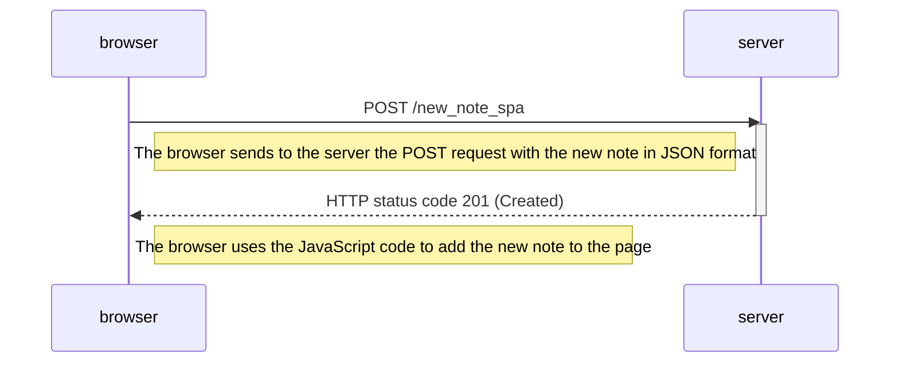

The diagram is based on Full stack open's provided code under "0.4: New note diagram".

```mermaid
sequenceDiagram
    participant browser
    participant server

    browser->>server: POST /new_note_spa
    activate server

    Note right of browser: The browser sends to the server the POST request with the new note in JSON format

    server-->>browser: HTTP status code 201 (Created)
    deactivate server

    Note right of browser: The browser uses the JavaScript code to add the new note to the page
```
